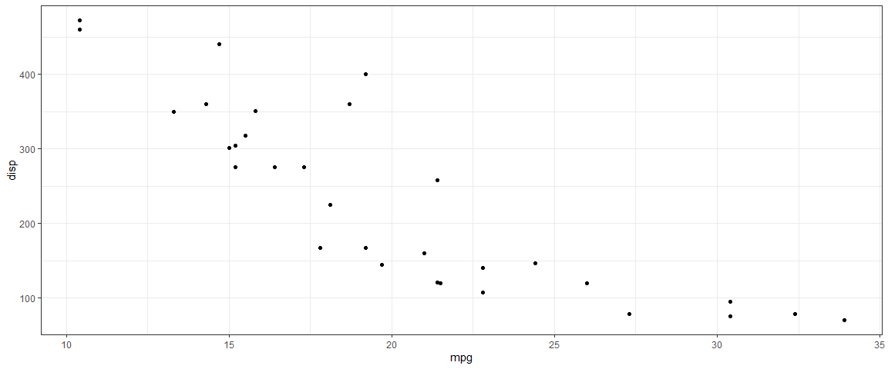
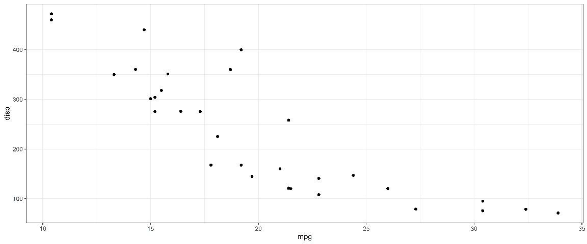

This report studies how to place previusly created plots into the body of the report.

<!--  Set the working directory to the repository's base directory; this assumes the report is nested inside of two directories.-->


# Environment
<!-- Load the sources.  Suppress the output when loading sources. --> 


<!-- Load packages, or at least verify they're available on the local machine.  Suppress the output when loading packages. -->

```r
library(magrittr)  # pipes
library(dplyr)     # data wrangling
library(ggplot2)   # graphs
library(janitor)   # tidy data
library(tidyr)     # data wrangling
library(forcats)   # factors
library(stringr)   # strings
library(lubridate) # dates
```


<!-- Load any Global functions and variables declared in the R file.  Suppress the output. --> 


```r
prints_folder <- paste0("./analysis/002-placing-plots/prints/")
if(!file.exists(prints_folder)){
  dir.create(file.path(prints_folder))
}

ggplot2::theme_set(
  ggplot2::theme_bw(
  )+
    theme(
      strip.background = element_rect(fill="grey95", color = NA)
    )
)
quick_save <- function(g,name,...){
  ggplot2::ggsave(
    # filename = paste0(name,".jpg"),
    filename = paste0(name,".png"),
    plot     = g,
    # device   = "jpg",
    device   = "png",
    path     = prints_folder,
    # width    = width,
    # height   = height,
    # units = "cm",
    # dpi      = 'retina',
    limitsize = FALSE,
    ...
  )
}
```

# Data


# Printed in Chunk


```r
g <-
  mtcars %>%
  ggplot(aes(x=mpg,y=disp))+
  geom_point()
g
```



# Placed from File

```r
file_name <- "plot-1"
# g %>% quick_save("plot-1",width = 12, height = 5)
g %>% quick_save(file_name,width = 12, height =5, dpi =1000)
file_path <- paste0(prints_folder,file_name,".png")
# file_path %>% jpeg::readJPEG() %>% grid::grid.raster()
file_path %>% png::readPNG() %>% grid::grid.raster()
```



Session Information {#session-info}
===========================================================================

For the sake of documentation and reproducibility, the current report was rendered in the following environment.  Click the line below to expand.

<details>
  <summary>Environment <span class="glyphicon glyphicon-plus-sign"></span></summary>

```
- Session info -----------------------------------------------------------------------------------
 setting  value                       
 version  R version 4.1.0 (2021-05-18)
 os       Windows 10 x64              
 system   x86_64, mingw32             
 ui       RTerm                       
 language (EN)                        
 collate  English_United States.1252  
 ctype    English_United States.1252  
 tz       America/Denver              
 date     2021-10-26                  

- Packages ---------------------------------------------------------------------------------------
 package     * version date       lib source        
 assertthat    0.2.1   2019-03-21 [1] CRAN (R 4.1.0)
 bslib         0.2.5.1 2021-05-18 [1] CRAN (R 4.1.0)
 cachem        1.0.5   2021-05-15 [1] CRAN (R 4.1.0)
 callr         3.7.0   2021-04-20 [1] CRAN (R 4.1.0)
 cli           3.0.1   2021-07-17 [1] CRAN (R 4.1.0)
 colorspace    2.0-2   2021-06-24 [1] CRAN (R 4.1.0)
 crayon        1.4.1   2021-02-08 [1] CRAN (R 4.1.0)
 DBI           1.1.1   2021-01-15 [1] CRAN (R 4.1.0)
 desc          1.3.0   2021-03-05 [1] CRAN (R 4.1.0)
 devtools      2.4.2   2021-06-07 [1] CRAN (R 4.1.0)
 digest        0.6.27  2020-10-24 [1] CRAN (R 4.1.0)
 dplyr       * 1.0.7   2021-06-18 [1] CRAN (R 4.1.0)
 ellipsis      0.3.2   2021-04-29 [1] CRAN (R 4.1.0)
 evaluate      0.14    2019-05-28 [1] CRAN (R 4.1.0)
 fansi         0.5.0   2021-05-25 [1] CRAN (R 4.1.0)
 farver        2.1.0   2021-02-28 [1] CRAN (R 4.1.0)
 fastmap       1.1.0   2021-01-25 [1] CRAN (R 4.1.0)
 forcats     * 0.5.1   2021-01-27 [1] CRAN (R 4.1.0)
 fs            1.5.0   2020-07-31 [1] CRAN (R 4.1.0)
 generics      0.1.0   2020-10-31 [1] CRAN (R 4.1.0)
 ggplot2     * 3.3.5   2021-06-25 [1] CRAN (R 4.1.0)
 glue          1.4.2   2020-08-27 [1] CRAN (R 4.1.0)
 gtable        0.3.0   2019-03-25 [1] CRAN (R 4.1.0)
 highr         0.9     2021-04-16 [1] CRAN (R 4.1.0)
 htmltools     0.5.1.1 2021-01-22 [1] CRAN (R 4.1.0)
 janitor     * 2.1.0   2021-01-05 [1] CRAN (R 4.1.0)
 jquerylib     0.1.4   2021-04-26 [1] CRAN (R 4.1.0)
 jsonlite      1.7.2   2020-12-09 [1] CRAN (R 4.1.0)
 knitr       * 1.33    2021-04-24 [1] CRAN (R 4.1.0)
 labeling      0.4.2   2020-10-20 [1] CRAN (R 4.1.0)
 lifecycle     1.0.0   2021-02-15 [1] CRAN (R 4.1.0)
 lubridate   * 1.7.10  2021-02-26 [1] CRAN (R 4.1.0)
 magrittr    * 2.0.1   2020-11-17 [1] CRAN (R 4.1.0)
 memoise       2.0.0   2021-01-26 [1] CRAN (R 4.1.0)
 munsell       0.5.0   2018-06-12 [1] CRAN (R 4.1.0)
 pillar        1.6.2   2021-07-29 [1] CRAN (R 4.1.0)
 pkgbuild      1.2.0   2020-12-15 [1] CRAN (R 4.1.0)
 pkgconfig     2.0.3   2019-09-22 [1] CRAN (R 4.1.0)
 pkgload       1.2.1   2021-04-06 [1] CRAN (R 4.1.0)
 png           0.1-7   2013-12-03 [1] CRAN (R 4.1.1)
 prettyunits   1.1.1   2020-01-24 [1] CRAN (R 4.1.0)
 processx      3.5.2   2021-04-30 [1] CRAN (R 4.1.0)
 ps            1.6.0   2021-02-28 [1] CRAN (R 4.1.0)
 purrr         0.3.4   2020-04-17 [1] CRAN (R 4.1.0)
 R6            2.5.0   2020-10-28 [1] CRAN (R 4.1.0)
 Rcpp          1.0.7   2021-07-07 [1] CRAN (R 4.1.0)
 remotes       2.4.0   2021-06-02 [1] CRAN (R 4.1.0)
 rlang         0.4.11  2021-04-30 [1] CRAN (R 4.1.0)
 rmarkdown     2.10    2021-08-06 [1] CRAN (R 4.1.0)
 rprojroot     2.0.2   2020-11-15 [1] CRAN (R 4.1.0)
 rstudioapi    0.13    2020-11-12 [1] CRAN (R 4.1.0)
 sass          0.4.0   2021-05-12 [1] CRAN (R 4.1.0)
 scales        1.1.1   2020-05-11 [1] CRAN (R 4.1.0)
 sessioninfo   1.1.1   2018-11-05 [1] CRAN (R 4.1.0)
 snakecase     0.11.0  2019-05-25 [1] CRAN (R 4.1.0)
 stringi       1.7.3   2021-07-16 [1] CRAN (R 4.1.0)
 stringr     * 1.4.0   2019-02-10 [1] CRAN (R 4.1.0)
 testthat      3.0.4   2021-07-01 [1] CRAN (R 4.1.0)
 tibble        3.1.2   2021-05-16 [1] CRAN (R 4.1.0)
 tidyr       * 1.1.3   2021-03-03 [1] CRAN (R 4.1.0)
 tidyselect    1.1.1   2021-04-30 [1] CRAN (R 4.1.0)
 usethis       2.0.1   2021-02-10 [1] CRAN (R 4.1.0)
 utf8          1.2.1   2021-03-12 [1] CRAN (R 4.1.0)
 vctrs         0.3.8   2021-04-29 [1] CRAN (R 4.1.0)
 withr         2.4.2   2021-04-18 [1] CRAN (R 4.1.0)
 xfun          0.24    2021-06-15 [1] CRAN (R 4.1.0)
 yaml          2.2.1   2020-02-01 [1] CRAN (R 4.1.0)

[1] C:/Users/koval/Documents/R/win-library/4.1
[2] C:/Program Files/R/R-4.1.0/library
```
</details>


Report rendered by koval at 2021-10-26, 10:05 -0600 in 44 seconds.
